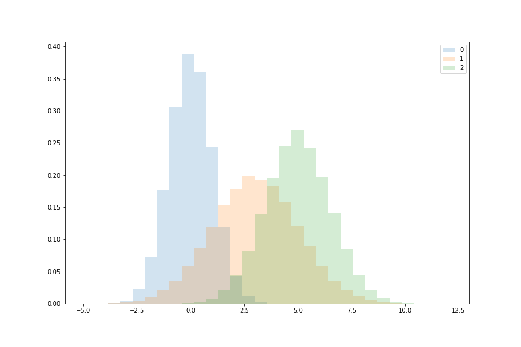
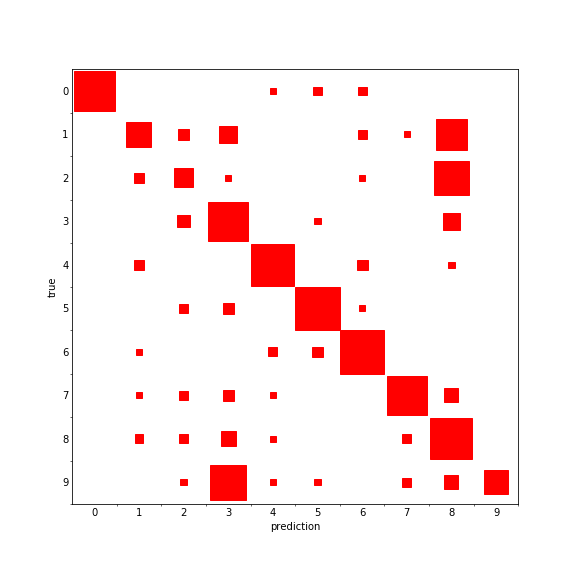

# Graphing Tools

Assorted tools I've written for general graphing, including better-aligned histograms

and confusion matrices using squares to show the number of samples

See the Usage.ipynb notebook for more examples.

